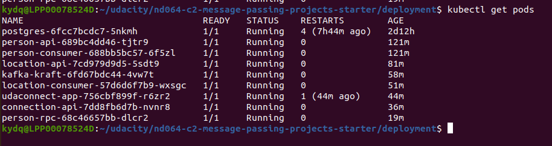
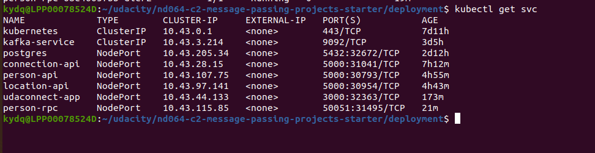

# Start project

```shell

kubectl apply -f deployment/db-configmap.yaml
kubectl apply -f deployment/db-secret.yaml
kubectl apply -f deployment/kafka-configmap.yaml
kubectl apply -f deployment/postgres.yaml
kubectl apply -f deployment/kafka.yaml
kubectl apply -f deployment/person-rpc.yaml
kubectl apply -f deployment/udaconnect-api.yaml
kubectl apply -f deployment/udaconnect-connection.yaml
kubectl apply -f deployment/udaconnect-location.yaml
kubectl apply -f deployment/udaconnect-location-consumer.yaml
kubectl apply -f deployment/udaconnect-person.yaml
kubectl apply -f deployment/udaconnect-person-consumer.yaml

```

# get pods


# get svc
